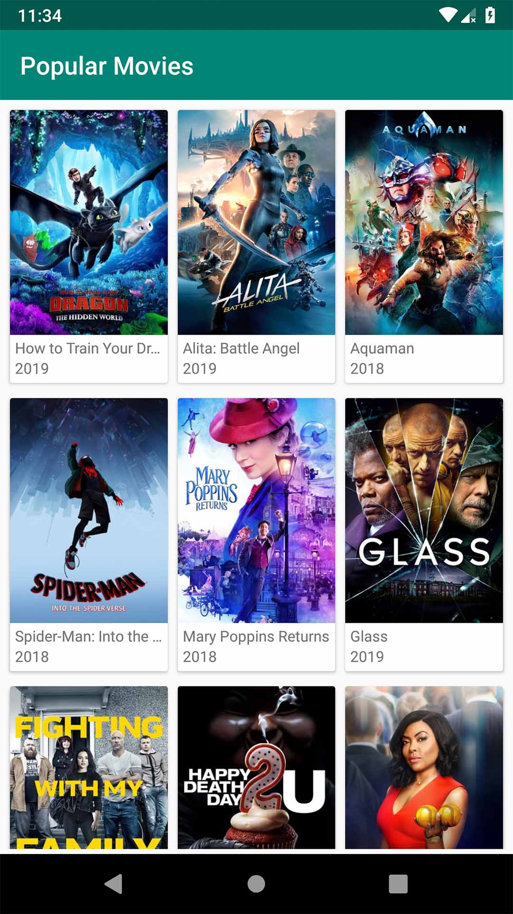
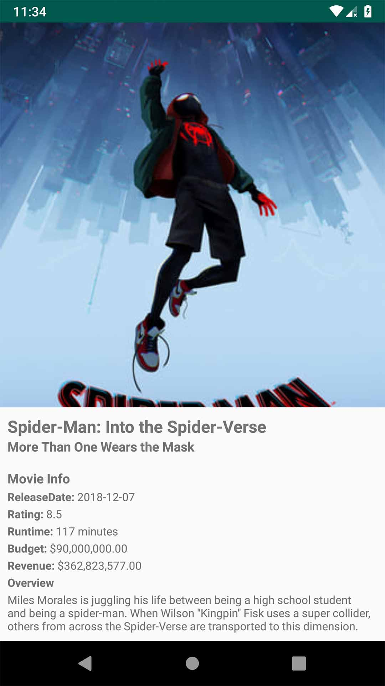

# Movie MVVM App

This is a simple Android app that showcases popular movies using the MVVM architectural pattern. It uses the [The Movie Database (TMDb) API](https://www.themoviedb.org/documentation/api) to fetch movie data.

This project was inspired by the YouTube tutorial [Watch the Tutorial](https://www.youtube.com/watch?v=1R5j7xMXjM8&list=PLRRNzqzbPLd906bPH-xFz9Oy2IcjqVWCH&ab_channel=OXCoding).

## Features

- Display a list of popular movies.
- View movie details including title, release date, and poster.
- Pagination for loading more movies.
- Handling of network errors and loading states.

## Screenshots

# Home Page 

# Detail Page

## Libraries and Technologies Used

- Kotlin
- Android Architecture Components (ViewModel, LiveData)
- Retrofit for network requests
- Glide for image loading
- AndroidX for modern Android development
- Paging library for pagination